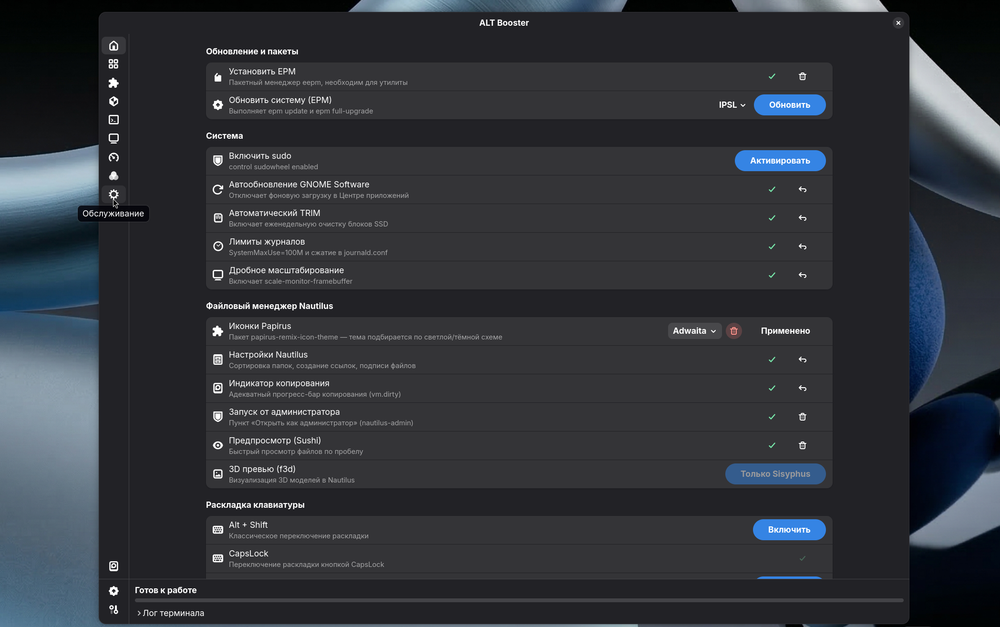

<div align="center">


# ALT Booster

**Утилита обслуживания системы ALT Linux с графическим интерфейсом GTK4/Adwaita**

[](LICENSE)
[](https://altlinux.org)
[](https://gtk.org)
[](https://python.org)

</div>

<div align="center">
  
</div>

---

## О проекте

ALT Booster — нативное GTK4-приложение для рутинного обслуживания системы ALT Linux.  
Запускается от обычного пользователя, привилегированные команды выполняются через `sudo`.

## Возможности

| Задача | Команда |
|--------|---------|
| 🗑️ Очистка кэша APT | `apt-get clean` |
| 🧩 Уборка Flatpak | `flatpak uninstall --unused` |
| 📋 Сжатие журналов | `journalctl --vacuum-time=14d` |
| 💾 Кэш DaVinci Resolve | `find ... -delete` |
| 🖥️ Балансировка Btrfs | `btrfs balance start` |
| 🔄 Дефрагментация Btrfs | `btrfs filesystem defragment` |
| ⚡ SSD TRIM | `fstrim -av` |

## Требования

- ALT Linux (Sisyphus / p10 / p11)
- Python 3.10+
- GTK 4.0 + libadwaita
- GNOME или совместимый Wayland DE

## Установка

### 1. Зависимости

```bash
sudo apt-get install python3-module-pygobject3 libgtk4-gir libadwaita-gir
```

### 2. Клонировать и установить

```bash
git clone https://github.com/YOUR_USERNAME/alt-booster.git
cd alt-booster
bash install.sh
```

### 3. Запустить

```bash
altbooster
# или через меню приложений GNOME
```

## Удаление

```bash
bash uninstall.sh
```

## Структура проекта

```
alt-booster/
├── src/
│   └── altbooster.py     # Основной код приложения
├── icons/
│   └── altbooster.svg    # Иконка приложения
├── install.sh            # Установщик
├── uninstall.sh          # Деинсталлятор
└── README.md
```

## Лицензия

[MIT](LICENSE) © 2026 PLAFON
