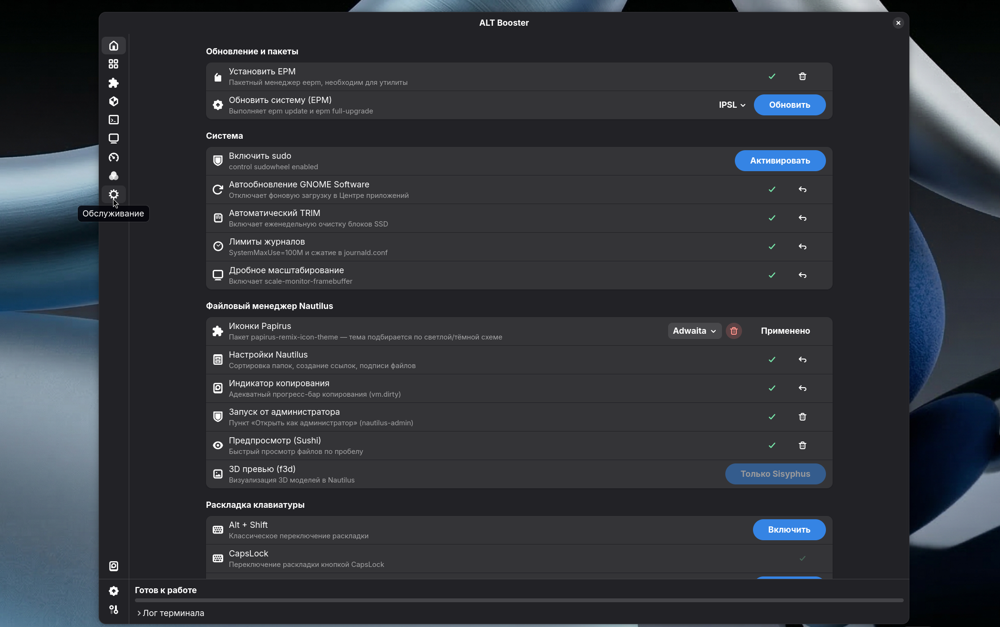

<div align="center">


# ALT Booster

Умная утилита для тонкой настройки и обслуживания ALT Linux. Создана с фокусом на безопасность, надёжность и современный интерфейс на GTK4/Adwaita.

[](LICENSE)
[](https://altlinux.org)
[](https://packages.altlinux.org/ru/sisyphus/srpms/plafon-altbooster/)
[](https://gtk.org)
[](https://python.org)

</div>

<div align="center">
  
</div>

---

## О проекте

**ALT Booster** — это нативное GTK4-приложение для тонкой настройки и обслуживания ALT Linux, спроектированное с акцентом на **безопасность, надёжность и удобство**.

В отличие от простых скриптов, ALT Booster предлагает:
- **Безопасное выполнение команд:** Изолированное и безопасное повышение привилегий через `sudo` с опциональной интеграцией со связкой ключей GNOME.
- **Отзывчивый интерфейс:** Все длительные операции выполняются в фоновом потоке, не замораживая приложение.
- **Умное решение проблем:** Утилита автоматически решает распространённые проблемы, такие как установка недостающих зависимостей или обновление кэша пакетов при ошибках.
- **Надёжность:** Продуманные проверки (например, поиск зависимостей перед удалением пакета) защищают систему от случайных поломок.

## Ключевые возможности

### Интеллектуальная установка и настройка
- **Умный менеджер приложений:** Установка ПО из Flathub и EPM. При возникновении ошибок 404 (устаревшие индексы) утилита автоматически выполнит `apt-get update` и повторит установку.
- **Менеджер расширений GNOME:** Поиск, установка и управление расширениями. Если зависимость `gext` не найдена, ALT Booster предложит и выполнит её автоматическую установку для пользователя.
- **Безопасное удаление:** При удалении системных расширений GNOME, упакованных в RPM, утилита сперва проверяет наличие обратных зависимостей, чтобы предотвратить поломку системы.
- **Контекстно-зависимый UI:** Задачи для Btrfs автоматически скрываются, если система не использует эту файловую систему.

### Безопасность и надёжность
- **Безопасная работа с `sudo`:** Для выполнения команд с повышенными привилегиями используется надёжный механизм `SUDO_ASKPASS`, что безопаснее прямого ввода пароля в `stdin`.
- **Интеграция с Keyring:** Опциональная возможность безопасно сохранить пароль `sudo` в системной связке ключей (GNOME Keyring) через `libsecret`.
- **Защита от случайных действий:** Задача очистки кэша имеет встроенную защиту от удаления важных директорий (таких как `/` или `~`), а все пути экранируются для предотвращения инъекций.
- **Атомарная запись:** Конфигурационные файлы сохраняются атомарно (запись во временный файл с последующим переименованием), что защищает их от повреждения в случае сбоя.

### Продвинутый пользовательский опыт
- **Data-Driven UI:** Большая часть интерфейса (задачи обслуживания, каталог приложений) генерируется на основе JSON-файлов, что делает добавление нового функционала простым и быстрым.
- **Отзывчивый интерфейс:** Все длительные операции выполняются в фоновых потоках, а пользователю предоставляется наглядная обратная связь через индикаторы прогресса и логи.
- **Самообновление:** Приложение умеет проверять наличие новых версий на GitHub и выполнять обновление (через `git pull` или скачивая архив).

## Требования

- ALT Linux (Sisyphus / p10 / p11)
- Python 3.10+
- GTK 4.0 + libadwaita
- GNOME или совместимый Wayland DE
- git

## Установка

### 1. Установите git

```bash
su - -c 'apt-get install git'
```

### 2. Клонировать и установить

```bash
git clone https://github.com/plafonlinux/altbooster.git
cd altbooster
./install.sh
```

### 3. Запустить

```bash
altbooster
# или через меню приложений GNOME
```

### Удаление

```bash
./uninstall.sh
```

## Структура проекта

```
altbooster/
├── icons/                     # Графические ресурсы (иконки .svg, .png)
│   ├── altbooster.svg/.png    # Иконка приложения
│   └── hicolor/               # Иконки для системных тем GTK
├── src/                       # Исходный код приложения
│   ├── altbooster.py          # Точка входа в приложение
│   ├── core/                  # Бэкенд-модули для взаимодействия с системой
│   │   ├── backend.py         # Фасад, агрегирующий API всего бэкенда
│   │   ├── borg.py            # Операции BorgBackup (низкоуровневые)
│   │   ├── btrfs.py           # Снэпшоты и операции Btrfs
│   │   ├── checks.py          # Функции проверки состояния системы
│   │   ├── config.py          # Пути, версия, state.json, константы
│   │   ├── gsettings.py       # Обёртки для gsettings/dconf
│   │   ├── packages.py        # Логика epm и flatpak
│   │   ├── privileges.py      # Безопасное выполнение команд через sudo/pkexec
│   │   └── tweaks.py          # Реализация конкретных системных твиков
│   ├── modules/               # JSON-файлы, описывающие UI для Data-Driven страниц
│   ├── tabs/                  # Модули вкладок приложения
│   │   ├── amd.py             # Вкладка «AMD»
│   │   ├── amd_actions.py     # Действия для AMD-страницы
│   │   ├── apps.py            # Вкладка «Приложения»
│   │   ├── davinci.py         # Вкладка «DaVinci Resolve»
│   │   ├── extensions.py      # Вкладка «Расширения GNOME»
│   │   ├── flatpak.py         # Вкладка «Flatpak»
│   │   ├── intel.py           # Вкладка «Intel» (scx_meteor)
│   │   ├── maintenance.py     # Вкладка «Обслуживание»
│   │   ├── setup.py           # Вкладка «Начало»
│   │   ├── terminal.py        # Вкладка «Терминал»
│   │   ├── terminal_actions.py# Действия для терминальной страницы
│   │   └── timesync/          # Вкладка «Резервная копия» (Time Machine / BorgBackup)
│   │       ├── page.py        # Главная страница вкладки
│   │       ├── borg.py        # UI-логика резервного копирования
│   │       ├── schedule.py    # Настройка расписания (systemd-таймеры)
│   │       ├── snapshots.py   # Просмотр и управление снэпшотами
│   │       ├── restore.py     # Восстановление из резервной копии
│   │       ├── pickers.py     # Диалоги выбора файлов/директорий
│   │       ├── metadata.py    # Метаданные архивов
│   │       └── summary.py     # Сводный диалог после операций
│   └── ui/                    # Переиспользуемые UI-компоненты
│       ├── common.py          # Общие вспомогательные функции UI
│       ├── dialogs.py         # Кастомные диалоговые окна (пароль, редактор)
│       ├── dynamic_page.py    # Движок, генерирующий UI на основе JSON
│       ├── install_preview_dialog.py # Диалог предпросмотра установки
│       ├── rows.py            # Переиспользуемые Adw.ActionRow / Adw.ExpanderRow
│       ├── widgets.py         # Фабрики стандартных виджетов Adwaita/GTK
│       └── window.py          # AltBoosterWindow: layout, аутентификация, логи
├── install.sh                 # Скрипт установки
├── uninstall.sh               # Скрипт удаления
├── Makefile                   # Сборка и установка через make
├── pyproject.toml             # Метаданные проекта и зависимости (PEP 621)
├── CHANGELOG.md               # История изменений
├── CONTRIBUTING.md            # Руководство для участников
└── README.md                  # Этот файл
```

## Лицензия

[MIT](LICENSE) © 2026 PLAFON
